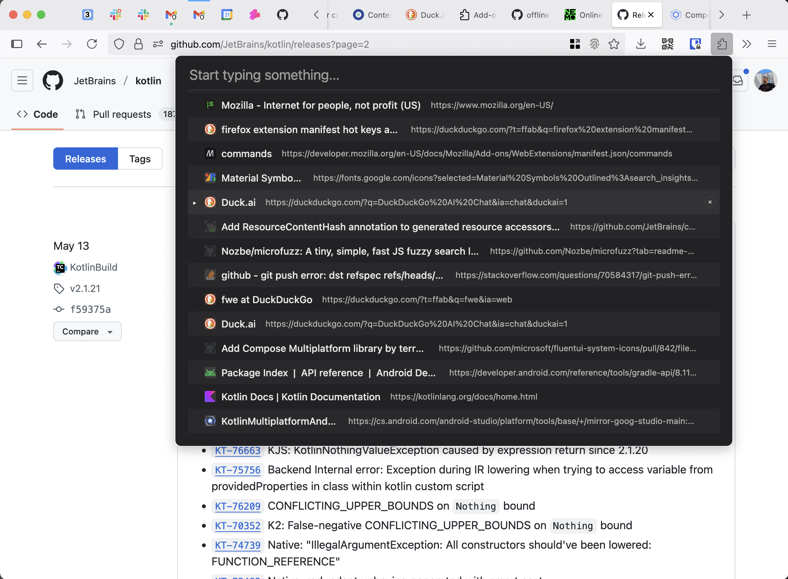
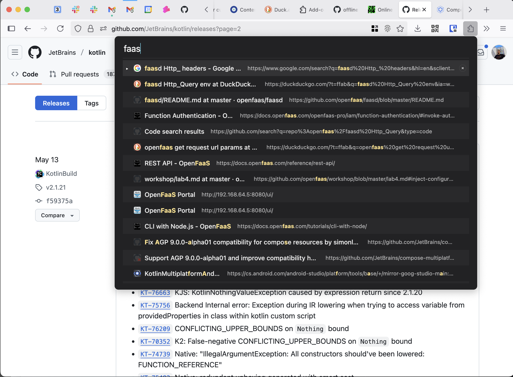
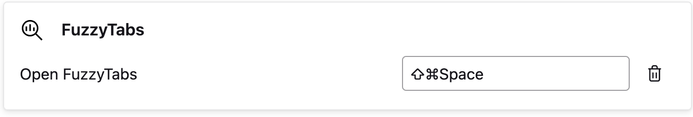

  

<h1 align="center">FuzzyTabs</h1>

Lightning-fast, lightweight, open‑source fuzzy search across your browser tabs.

---

  
  

FuzzyTabs is a minimal browser extension that lets you quickly find and switch between your open tabs using fuzzy
search.
It runs instantly, stays out of your way, and keeps resource usage low.

## Features

- Fuzzy search: Type a few characters and jump to the right tab with smart, forgiving matching.
- Fast: Snappy overlay with near-instant filtering across all your open tabs.
- Lightweight: Small footprint, no tracking, minimal permissions.
- Open source: Built in the open — contributions and ideas are welcome.

## Usage

Press Ctrl+Shift+I (by default) to open the popup.

## Settings

  
  

## Support

